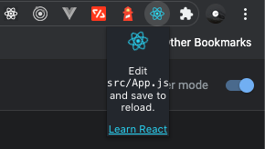

## Chrome Extentions with React 
This is a simple demo for getting started with building chrome extensions with React JS.

### Steps: 
- Start / scaffold a react project from [create-react-app](https://reactjs.org/docs/create-a-new-react-app.html).
- Go to the [manifest.json](/public/manifest.json) file present inside `/public/manifest.json`.
- Edit it out to something like this :
    ```
    {
        "manifest_version": 2,

        "name": "My Extension",
        "description": "This extension is a starting point to create a real Chrome extension",
        "version": "0.0.1",

        "browser_action": {
            "default_popup": "index.html",
            "default_title": "Open the popup"
        },
        "icons": {
            "16": "logo192.png",
            "48": "logo192.png",
            "128": "logo192.png"
        },
        "content_security_policy": "script-src 'self' 'sha256-fZT+6n/AXzmqH0sLRfHGVa5Ytj+5XvueWpa6CXFv/SM='; object-src 'self'",  "permissions": [
        ]
    }
    ``` 
- After this run the command `npm run build` or `yarn build`.
- This will generate a build folder in your root directory. After this open chrome and go into `More Tools` -> `Extentions`. Make sure you have enabled developer mode.
  - Choose to upload an unpacked extension, choose the build folder and you have your first React extension.

### Your first React extension

<p align="center">
    
</p>

### In-Depth actions

So what if you want to implement a complex extension with many components and styles? 
Well this is possible but with the cost of it having breaking during run-time. This is solved by encapsulating each component inside a react-frame so that the **CSS** and **JS** are encapsulated to each component.

- [React-Frame ~ npm](https://www.npmjs.com/package/react-frame-component)
- [React-Frame ~ github](https://github.com/ryanseddon/react-frame-component)

> This is better explained by [Satendra](https://github.com/satendra02) in his in depth [blog](https://itnext.io/create-chrome-extension-with-reactjs-using-inject-page-strategy-137650de1f39).

> Infact there is a custom boilerplate with the react-frame and the APIs from chrome implemented [here](https://github.com/satendra02/react-chrome-extension).